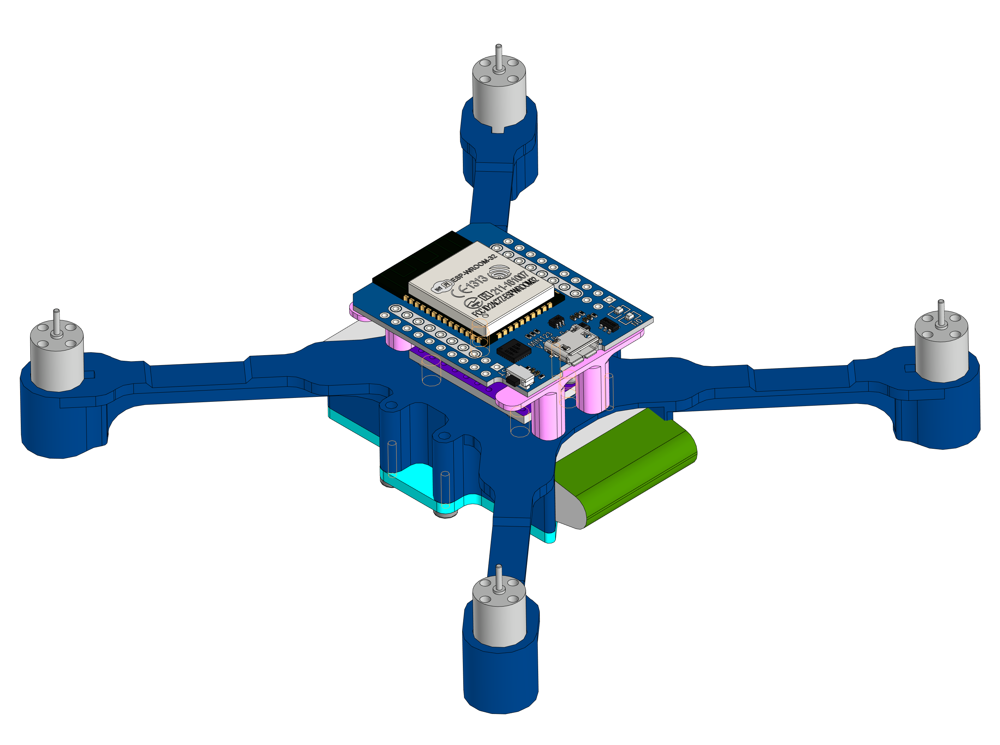
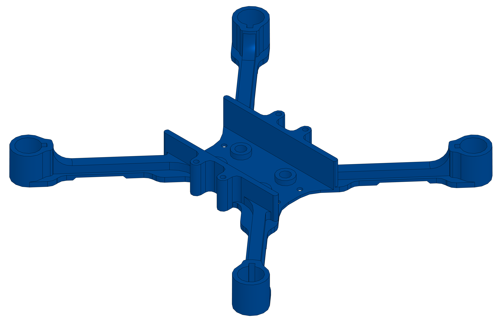

# 3d

---

# assembled

<table>
<tr valign="top">
<td></td>
</tr>
</table>

[`.png`](./assembled.png) [`.stp`](./assembled.stp)

---

# battery_holder

<table>
<tr valign="top">
<td></td>
</tr>
</table>

[`.m3d`](./battery_holder.m3d) [`.png`](./battery_holder.png) [`.stp`](./battery_holder.stp)

---

# controller_holder

<table>
<tr valign="top">
<td></td>
</tr>
</table>

[`.m3d`](./controller_holder.m3d) [`.png`](./controller_holder.png) [`.stp`](./controller_holder.stp)

---

# frame

<table>
<tr valign="top">
<td></td>
</tr>
</table>

[`.m3d`](./frame.m3d) [`.png`](./frame.png) [`.stp`](./frame.stp)

---

