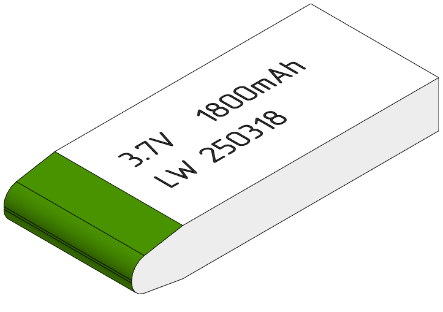
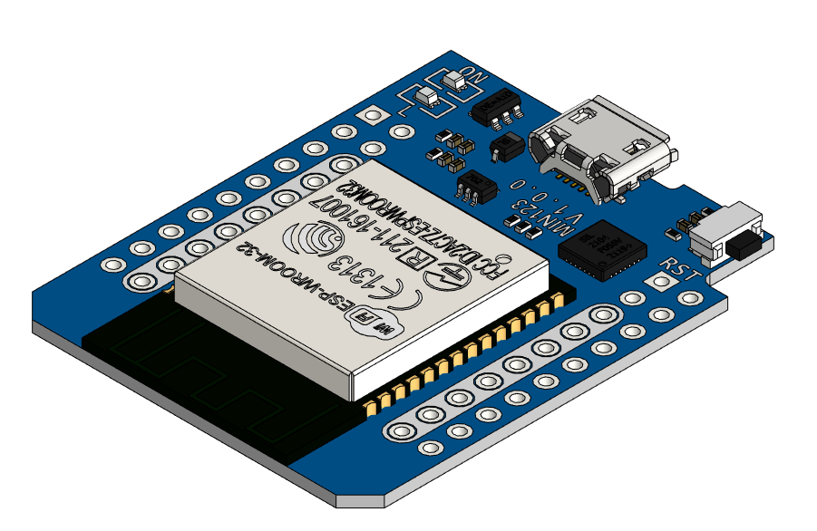
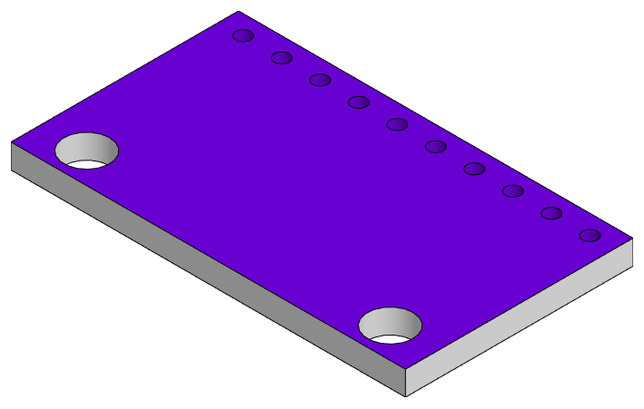
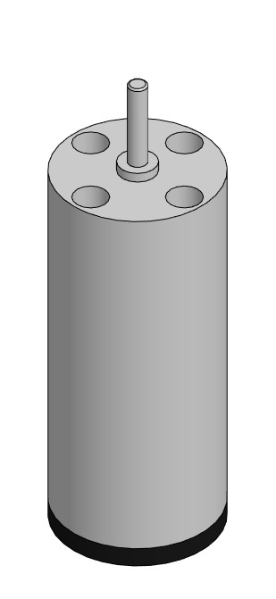

# components

---

# battery

<table>
<tr valign="top">
<td></td>
</tr>
</table>

[.m3d](./"battery.m3d") [.png](./"battery.png") [.stp](./"battery.stp")

---

# controller

<table>
<tr valign="top">
<td></td>
</tr>
</table>

[.a3d](./"controller.a3d") [.png](./"controller.png") [.stp](./"controller.stp")

---

# imu

<table>
<tr valign="top">
<td></td>
</tr>
</table>

[.m3d](./"imu.m3d") [.png](./"imu.png") [.stp](./"imu.stp")

---

# motor

<table>
<tr valign="top">
<td></td>
</tr>
</table>

[.m3d](./"motor.m3d") [.png](./"motor.png") [.stp](./"motor.stp")

---

