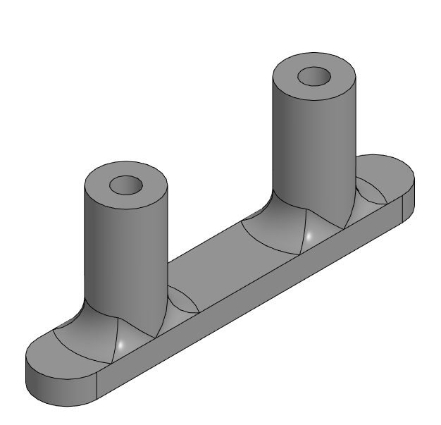
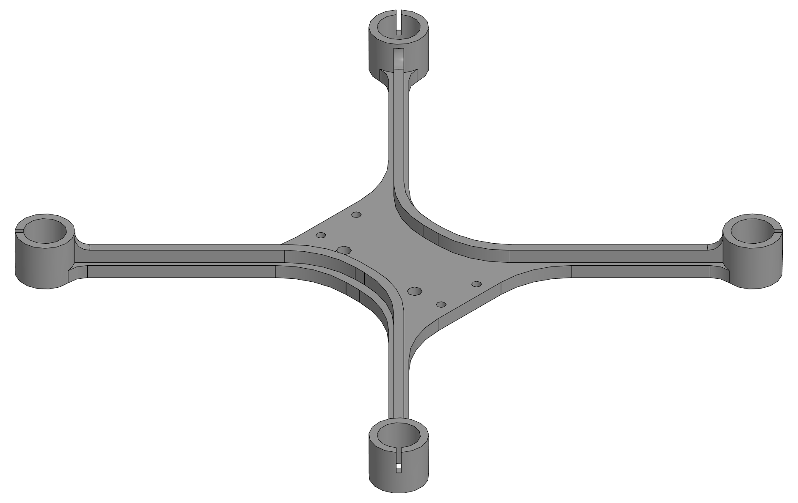

# v2

---

# esp_holder

<table>
<tr valign="top">
<td></td>
</tr>
</table>

[.m3d](./"esp_holder.m3d") [.png](./"esp_holder.png") [.stp](./"esp_holder.stp")

---

# frame

<table>
<tr valign="top">
<td></td>
</tr>
</table>

[.m3d](./"frame.m3d") [.png](./"frame.png") [.stp](./"frame.stp")

---

